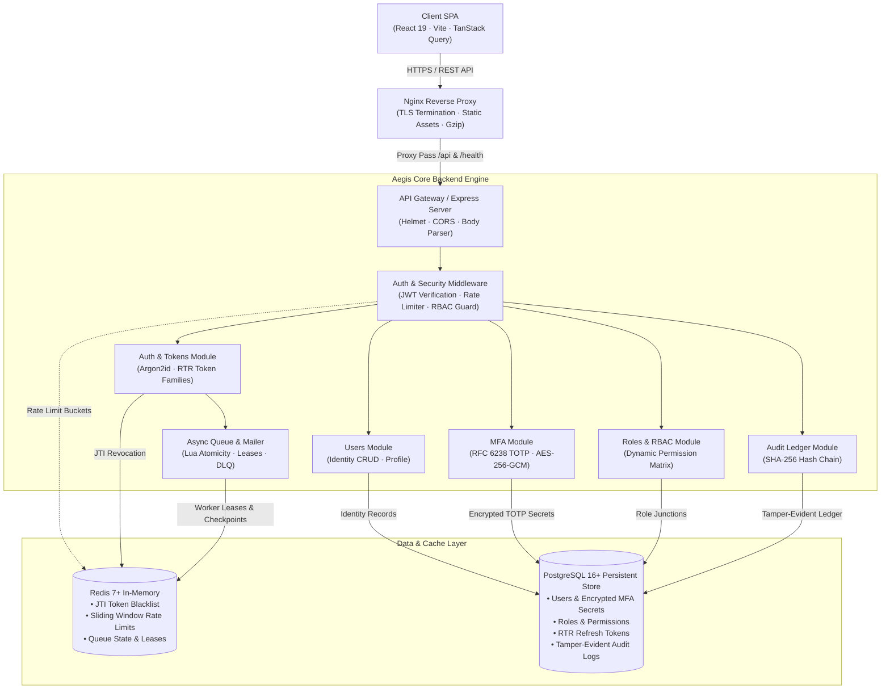
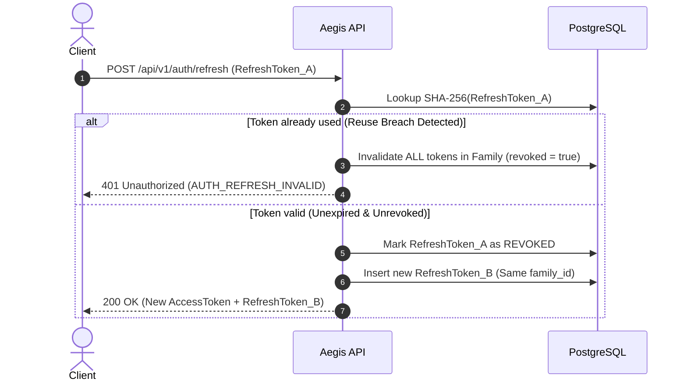
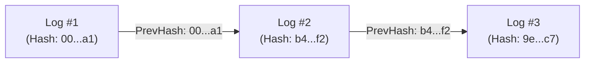

# Aegis IAM — System Architecture & Design

A deep-dive technical overview of Aegis IAM's architecture, security models, data flows, and state management.

---

## 1. High-Level Architecture



---

## 2. Authentication & Token Lifecycle

### Token Strategy
- **Access Tokens:** Signed with JWT (`HS256` or `RS256`), 15-minute lifespan. Stored securely in memory by the client.
- **Refresh Tokens:** Cryptographically random tokens stored in PostgreSQL with family-based rotation.
- **Token Invalidation:** Revoked access tokens on logout are immediately stored in a Redis-backed blacklist by `jti` with an automatic TTL matching the token's remaining lifetime (`SETEX bl:<jti> <ttl> 1`). Refresh tokens are invalidated and tracked directly in PostgreSQL.

### Refresh Token Rotation (RTR) Flow



---

## 3. Role-Based Access Control (RBAC)

Aegis implements granular permissions mapped to roles through a many-to-many junction schema.

### Permission Hierarchy

```
Super Admin  ───▶  System Administrator  ───▶  Security Auditor  ───▶  Standard User
   [Full]             [User & Role Admin]          [Read-Only Audit]         [Self Profile]
```

### Database Schema Relational Model
- `users`: User identity credentials, MFA configuration, account status.
- `roles`: Defined roles (`super_admin`, `admin`, `auditor`, `user`).
- `permissions`: Atomic actions (`users:read`, `users:write`, `roles:manage`, `audit:read`).
- `role_permissions`: Mapping between roles and permissions.
- `user_roles`: User role assignments.

---

## 4. Tamper-Evident Audit Logging

Audit logs guarantee integrity and non-repudiation using cryptographic hash chaining:

$$H_n = \text{SHA-256}(H_{n-1} \parallel \text{Timestamp} \parallel \text{ActorID} \parallel \text{Action} \parallel \text{Payload})$$



- **Verification Endpoint:** `/api/v1/audit/verify` verifies the continuous SHA-256 chain from the genesis block to the latest entry to detect database tampering.

---

## 5. Security & Cryptographic Standards

| Mechanism | Implementation | Purpose |
| :--- | :--- | :--- |
| **Password Hashing** | Argon2id | Resistant to GPU/ASIC brute-force attacks |
| **MFA Secrets** | AES-256-GCM | Encrypted storage of TOTP seeds at rest |
| **Access Token Revocation** | Redis `SETEX` (`bl:<jti>`) | Instant access-token JTI blacklisting on logout |
| **Refresh Token Lineage** | PostgreSQL `refresh_tokens` | Authoritative single-use tracking & atomic family-wide revocation |
| **Rate Limiting** | Redis (`rate-limit-redis`) | Distributed sliding-window brute-force & DDoS mitigation |
| **Tamper Detection** | SHA-256 Chaining | Verifiable, tamper-evident audit trails |
