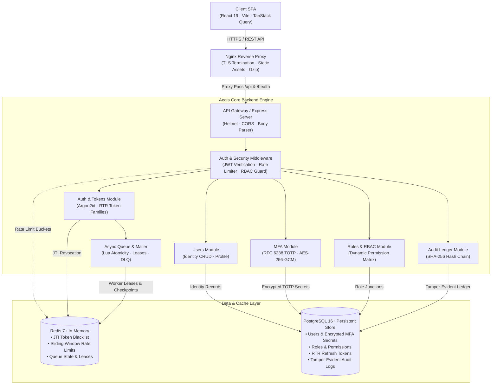
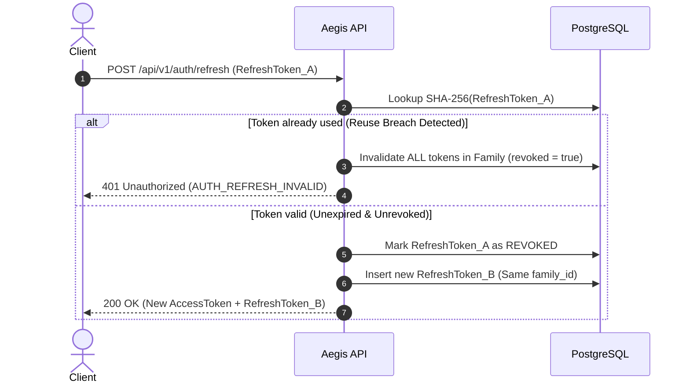
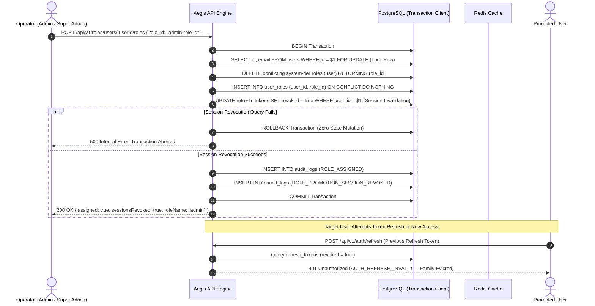
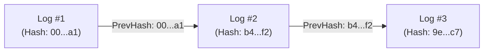

# Aegis IAM — System Architecture & Design

A deep-dive technical overview of Aegis IAM's architecture, security models, data flows, and state management.

---

## 1. High-Level Architecture



---

## 2. Authentication & Token Lifecycle

### Token Strategy
- **Access Tokens:** Signed with JWT (`HS256` or `RS256`), 15-minute lifespan. Stored securely in memory by the client.
- **Refresh Tokens:** Cryptographically random tokens stored in PostgreSQL with family-based rotation.
- **Token Invalidation:** Revoked access tokens on logout are immediately stored in a Redis-backed blacklist by `jti` with an automatic TTL matching the token's remaining lifetime (`SETEX bl:<jti> <ttl> 1`). Refresh tokens are invalidated and tracked directly in PostgreSQL.

### Refresh Token Rotation (RTR) Flow



---

## 3. Role-Based Access Control (RBAC) & Privilege Lifecycle

Aegis implements granular permissions mapped to roles through a many-to-many junction schema and enforces an uncompromising Zero-Trust privilege lifecycle.

### 3.1 Permission Hierarchy & System Role Tiers

System-defined roles are strictly tiered to govern access boundaries and privilege escalation:

```
Tier 3: Super Admin  ───▶  Tier 2: System Administrator  ───▶  Tier 1: Standard User
       [Full Root]                [User & Role Admin]               [Self Profile]
```

* **Tier 3 (`super_admin`):** Global authority, root RBAC matrix configuration, immutable system role policies.
* **Tier 2 (`admin`):** User management, role assignment, directory audit query, administrative password/MFA resets. Mandatory TOTP MFA required before session establishment.
* **Tier 1 (`user`):** Standard consumer identity, profile self-service, optional TOTP MFA enrollment.

---

### 3.2 Zero-Trust Role Promotion & Demotion Architecture

Privilege changes are critical attack surfaces. Aegis prohibits silent privilege elevation in existing sessions:

1. **Pessimistic Row-Level Locking (`SELECT ... FOR UPDATE`):**
   Concurrent role assignments for the same target user are strictly serialized at the PostgreSQL transaction level, eliminating race conditions during rapid administrative modifications.
2. **Single-Transaction Conflicting Tier Replacement:**
   System-tier roles (`super_admin`, `admin`, `user`) are mutually exclusive. When assigning a system-tier role, Aegis atomically deletes any conflicting system roles (`DELETE FROM user_roles WHERE user_id = $1 AND role_id != $2 AND role_id IN (system_role_ids) RETURNING role_id`) and inserts the new role in the same transaction boundary.
3. **Transaction-Bound Session Revocation (Failure Safety):**
   Upon detecting a privilege transition (**Promotion**: target tier $>$ prior tier; **Demotion**: target tier $<$ prior tier), all active refresh token families for the user are immediately revoked (`UPDATE refresh_tokens SET revoked = true WHERE user_id = $1 AND revoked = false`) within the **same transaction client**. If token revocation fails for any reason, the entire transaction rolls back via `ROLLBACK`, guaranteeing that a user's privileges are never updated without guaranteed session termination.
4. **Demotion Cleanup & Residual Secret Purge:**
   When an administrator or super administrator is demoted to standard user (`demotion && roleName === 'user'`), any unconfirmed/pending MFA secrets initiated during elevated status are purged (`UPDATE users SET mfa_secret = NULL, mfa_backup_codes = NULL WHERE id = $1 AND mfa_enabled = false`) to prevent stale TOTP binding attacks.
5. **Directional Transactional Audit Logging:**
   - **Promotion:** Logs `ROLE_ASSIGNED` and dedicated event `ROLE_PROMOTION_SESSION_REVOKED` with metadata `{ reason: 'Zero-Trust privilege escalation policy enforcement' }`.
   - **Demotion:** Logs `ROLE_ASSIGNED` and dedicated event `TOKEN_REVOKED` with metadata `{ reason: 'Zero-Trust privilege demotion session termination' }`.



---

### 3.3 Post-Promotion Flow & Scoped MFA Enrollment Tokens

When a promoted user attempts to authenticate:

1. **Refresh Intercept & Policy Enforcement:**
   If a promoted user presents a refresh token that somehow escaped revocation, `auth.service.js` re-evaluates `securityPolicy.evaluateLoginPolicy({ user, roles })`. If the user now holds an administrative role requiring MFA but has not yet enrolled, the refresh token family is immediately revoked, returning `401 Unauthorized (AUTH_POLICY_VIOLATION)`.
2. **Login Challenge & Scoped Token Issuance:**
   Upon authenticating at `/api/v1/auth/login` with correct password credentials, the policy detects `MFA_SETUP_REQUIRED`. The system **does not issue standard access or refresh tokens**. Instead, it generates a cryptographically signed, restricted **MFA Enrollment Token**:
   - **Scope:** Strictly constrained to `scope: 'mfa:enroll_only'`.
   - **Lifetime:** Short-lived 10-minute validity (`MFA_ENROLLMENT_TOKEN_EXPIRY_MINUTES`).
   - **Audit:** Logs `MFA_ENROLLMENT_TOKEN_ISSUED` in the audit ledger.
3. **API Endpoint Isolation (`authenticate` vs `authenticateMfaEnrollment`):**
   - Standard application endpoints protected by the `authenticate` middleware immediately reject tokens containing `mfa:enroll_only` with `HTTP 403 Forbidden` (`AUTH_TOKEN_SCOPE_RESTRICTED`).
   - Only setup endpoints protected by `authenticateMfaEnrollment` (`POST /api/v1/mfa/setup` and `POST /api/v1/mfa/verify`) accept this token.
4. **Atomic Token Consumption & Elevated Session Issuance:**
   During `/api/v1/mfa/verify`, under a locked user row (`FOR UPDATE`), the backend verifies that the user still holds a role mandating MFA (preventing race conditions if demoted mid-setup). It claims the token's `jti` in Redis using `SET key token EX ttl NX`. Upon successful TOTP code validation, it marks `mfa_enabled = true`, issues a full administrative session (Access Token + Refresh Token), and returns `200 OK`.

```mermaid
sequenceDiagram
    autonumber
    actor User as Promoted Administrator
    participant Front as SPA Frontend (React)
    participant API as Aegis API Gateway
    participant Redis as Redis
    participant DB as PostgreSQL

    User->>Front: Enter Email & Password
    Front->>API: POST /api/v1/auth/login
    API->>DB: Verify Argon2id Password Hash
    API->>API: Evaluate Zero-Trust Policy (MFA Mandatory for Admin)
    API->>DB: Log MFA_ENROLLMENT_TOKEN_ISSUED
    API-->>Front: 200 OK { mfa_setup_required: true, mfa_enrollment_token: "jwt.scoped..." }

    Front->>Front: Store token in sessionStorage; route to /mfa-setup
    Front->>API: POST /api/v1/mfa/setup (Bearer <mfa_enrollment_token>)
    API->>API: authenticateMfaEnrollment verifies scope: 'mfa:enroll_only'
    API->>DB: Generate AES-256 encrypted TOTP secret
    API-->>Front: 200 OK { secret, qr_code_uri, backup_codes }

    User->>Front: Enter 6-digit TOTP code
    Front->>API: POST /api/v1/mfa/verify { code: "123456" } (Bearer <mfa_enrollment_token>)
    API->>Redis: SET mfa:enrollment:<jti> token EX 600 NX (Atomic Claim)
    API->>DB: BEGIN Transaction & Lock User FOR UPDATE
    API->>DB: Validate Role Still Requires MFA
    API->>DB: UPDATE users SET mfa_enabled = true
    API->>DB: Issue Elevated Access Token & Rotated Refresh Token
    API->>DB: COMMIT Transaction
    API-->>Front: 200 OK { user, access_token, refresh_token }
    Front->>Front: Store credentials; redirect to /dashboard
```

---

## 4. Tamper-Evident Audit Logging

Audit logs guarantee integrity and non-repudiation using cryptographic hash chaining:

$$H_n = \text{SHA-256}(H_{n-1} \parallel \text{Timestamp} \parallel \text{ActorID} \parallel \text{Action} \parallel \text{Payload})$$



- **Verification Endpoint:** `/api/v1/audit/verify` verifies the continuous SHA-256 chain from the genesis block to the latest entry to detect database tampering.

---

## 5. Security & Cryptographic Standards

| Mechanism | Implementation | Purpose |
| :--- | :--- | :--- |
| **Password Hashing** | Argon2id | Resistant to GPU/ASIC brute-force attacks ($m=65536, t=3, p=4$) |
| **MFA Secrets** | AES-256-GCM | Authenticated encryption of TOTP seeds at rest with random 12-byte IVs |
| **Access Token Revocation** | Redis `SETEX` (`bl:<jti>`) | Instant access-token JTI blacklisting on logout matching remaining TTL |
| **Refresh Token Lineage** | PostgreSQL `refresh_tokens` | Authoritative single-use tracking & atomic family-wide revocation |
| **Role Promotion Invalidation** | Transaction-Bound SQL | Atomic revocation of all user refresh tokens on privilege change with automatic rollback |
| **Concurrency Serialization** | PostgreSQL `FOR UPDATE` | Row-level locking on users during role changes and MFA activations |
| **Scoped Enrollment Tokens** | JWT (`mfa:enroll_only`) | 10-minute restricted tokens barred from general API endpoints via 403 checks |
| **One-Time Token Claim** | Redis `SET NX` | Atomic anti-replay defense for scoped enrollment token consumption |
| **Rate Limiting** | Redis (`rate-limit-redis`) | Distributed sliding-window brute-force & DDoS mitigation |
| **Tamper Detection** | SHA-256 Chaining | Verifiable, tamper-evident audit trails with cryptographic linkage |

