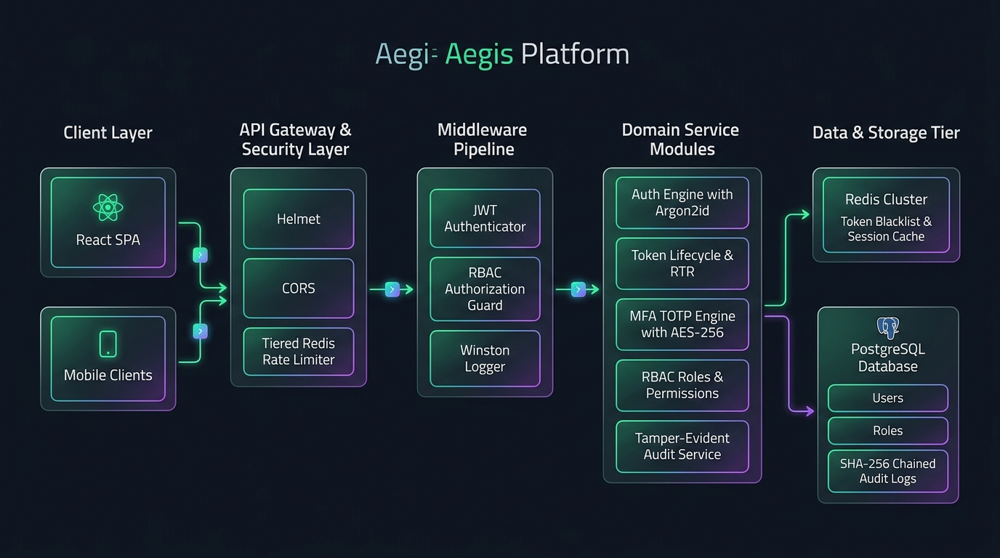

<div align="center">

  <h1>AEGIS IAM</h1>

  <p><strong>Enterprise Identity & Access Management Infrastructure</strong></p>
  <p><em>Production-grade, zero-trust IAM portal featuring JWT/OAuth 2.0, granular RBAC, RFC 6238 TOTP MFA, distributed Redis rate limiting, and tamper-evident PostgreSQL audit logging.</em></p>

  <p>
    <a href="https://github.com/Swatantra-66/aegis"></a>
    <a href="https://opensource.org/licenses/MIT"></a>
    <a href="https://nodejs.org/"></a>
    <a href="https://github.com/Swatantra-66/aegis"></a>
    <a href="https://redis.io/"></a>
    <a href="https://www.postgresql.org/"></a>
    <a href="https://www.docker.com/"></a>
  </p>

  <p>
    <a href="#high-level-design"><b>High-Level Design</b></a> •
    <a href="#-features"><b>Features</b></a> •
    <a href="./ARCHITECTURE.md"><b>Detailed Design</b></a> •
    <a href="./SECURITY.md"><b>Security Policy</b></a> •
    <a href="./ROADMAP.md"><b>Roadmap</b></a> •
    <a href="#-installation"><b>Quick Start</b></a> •
    <a href="./CONTRIBUTING.md"><b>Contributing</b></a>
  </p>

</div>

---

## High-Level Design

<div align="center">
  
</div>

### System Design Layer Breakdown

| Layer | Component | Technical Implementation & Responsibility |
| :--- | :--- | :--- |
| **1. Client Tier** | Vite React SPA & External APIs | Reactive user interface, multi-step MFA modal, live audit log viewer, and JWT token storage. |
| **2. API Gateway & Security** | Helmet, CORS, Tiered Redis Rate Limiter | Distributed brute-force mitigation (auth: 5 req/15min, api: 100 req/15min), security headers. |
| **3. Middleware Pipeline** | JWT Authenticator, RBAC Guard, Winston Logger | Bearer access token verification, permission bitmask evaluation, and structured JSON telemetry. |
| **4. Domain Micro-Modules** | Auth, Token RTR, MFA (TOTP), Roles, Audit | Argon2id hashing, family-based refresh token rotation, AES-256 encrypted TOTP seeds, SHA-256 audit chaining. |
| **5. Storage Tier** | Redis Cluster + PostgreSQL 14+ | In-memory token blacklist (`SETEX` + TTL sync) + ACID persistent relational schemas. |

---

## Features

### Core (Phase 1)
- **OAuth 2.0 / JWT Authentication** — Register, login, token refresh with rotation, logout
- **Multi-Factor Authentication (MFA)** — TOTP-based (Google Authenticator compatible) with backup codes
- **Role-Based Access Control (RBAC)** — Roles, permissions, junction tables, middleware guards
- **Token Lifecycle Management** — Short-lived access tokens (15min), refresh token rotation with reuse detection, Redis-backed blacklist
- **Tamper-Evident Audit Logging** — SHA-256 checksum chaining, filterable queries, integrity verification
- **API Rate Limiting** — Tiered limits per endpoint type (auth, API, admin)
- **Security Hardened** — Argon2id hashing, Helmet headers, CORS, AES-256-GCM encryption for MFA secrets

### Advanced (Phase 2 — Architecture Ready)
- SSO via OpenID Connect
- SCIM 2.0 User Provisioning
- Login Anomaly Detection

## Tech Stack

| Component | Technology |
|:---|:---|
| Runtime | Node.js 18+ |
| Framework | Express.js |
| Database | PostgreSQL |
| Cache/Sessions | Redis |
| Auth | JWT (jsonwebtoken) |
| Password Hashing | Argon2id |
| MFA | TOTP (otplib) |
| Validation | Joi |
| Logging | Winston |
| API Docs | Swagger/OpenAPI 3.0 |
| Testing | Jest + Supertest |
| Code Quality | ESLint + Prettier + Husky + lint-staged |

## Project Structure

```
src/
├── config/          # Environment validation, DB pool, Redis, Swagger
├── modules/
│   ├── auth/        # Register, login, refresh, logout, password reset
│   ├── users/       # User CRUD, profile management
│   ├── roles/       # RBAC role & permission management
│   ├── mfa/         # TOTP setup, verify, validate, disable
│   ├── tokens/      # JWT issuance, blacklist, rotation
│   └── audit/       # Tamper-evident logging, integrity verification
├── middleware/       # authenticate, authorize, rateLimiter, errorHandler
├── utils/           # AppError, apiResponse, logger, crypto
├── db/              # Migrations & seeds
├── app.js           # Express assembly (no listen)
└── server.js        # Entry point with graceful shutdown
```

## Quick Start

### Prerequisites
- **Node.js** 18+
- **Docker & Docker Compose** (Recommended for instant PostgreSQL & Redis) *or* local PostgreSQL 14+ & Redis 6+

### Installation & Setup

```bash
# 1. Clone the repository
git clone https://github.com/Swatantra-66/aegis.git
cd aegis

# 2. Install dependencies
npm install

# 3. Configure environment variables
cp .env.example .env
# Update credentials in .env if needed

# 4. Start PostgreSQL & Redis via Docker (Recommended)
docker compose up -d
# or using Makefile: make docker-up

# 5. Run database migrations & seed default RBAC roles
npm run migrate
npm run seed

# 6. Start development server (with nodemon live reload)
npm start
```

### Environment Variables

| Variable | Required | Default | Description |
|:---|:---|:---|:---|
| `NODE_ENV` | No | `development` | `development`, `production`, `test` |
| `PORT` | No | `3000` | Server port |
| `DB_HOST` | **Yes** | — | PostgreSQL host |
| `DB_PORT` | No | `5432` | PostgreSQL port |
| `DB_NAME` | **Yes** | — | Database name |
| `DB_USER` | **Yes** | — | Database user |
| `DB_PASSWORD` | **Yes** | — | Database password |
| `REDIS_URL` | **Yes** | — | Redis connection URL |
| `JWT_SECRET` | **Yes** | — | JWT signing secret (min 32 chars) |
| `JWT_REFRESH_SECRET` | **Yes** | — | Refresh token secret (min 32 chars) |
| `JWT_ACCESS_EXPIRY` | No | `15m` | Access token lifetime |
| `JWT_REFRESH_EXPIRY` | No | `7d` | Refresh token lifetime |
| `MFA_ENCRYPTION_KEY` | **Yes** | — | AES-256 key for TOTP secrets (min 32 chars) |

> **⚠️ The server will refuse to start if any required variable is missing or invalid.**

## API Endpoints

### Authentication

| Method | Endpoint | Description | Auth |
|:---|:---|:---|:---|
| POST | `/api/v1/auth/register` | Register new user | ✗ |
| POST | `/api/v1/auth/login` | Login (returns JWT) | ✗ |
| POST | `/api/v1/auth/refresh` | Refresh access token | ✗ |
| POST | `/api/v1/auth/logout` | Revoke tokens | ✓ |
| POST | `/api/v1/auth/forgot-password` | Request password reset | ✗ |
| POST | `/api/v1/auth/reset-password` | Complete password reset | ✗ |

### Users

| Method | Endpoint | Description | Permission |
|:---|:---|:---|:---|
| GET | `/api/v1/users/me` | Get own profile | Any authenticated |
| GET | `/api/v1/users` | List users (paginated) | `user:read` |
| GET | `/api/v1/users/:id` | Get user by ID | `user:read` |
| PATCH | `/api/v1/users/:id` | Update user | `user:update` |
| DELETE | `/api/v1/users/:id` | Deactivate user | `user:delete` |

### RBAC (Roles & Permissions)

| Method | Endpoint | Description | Permission |
|:---|:---|:---|:---|
| GET | `/api/v1/roles` | List all roles | `role:read` |
| POST | `/api/v1/roles` | Create role | `role:create` |
| GET | `/api/v1/roles/:id` | Get role details | `role:read` |
| PATCH | `/api/v1/roles/:id` | Update role | `role:update` |
| DELETE | `/api/v1/roles/:id` | Delete role | `role:delete` |
| POST | `/api/v1/roles/:id/permissions` | Assign permissions | `role:update` |
| DELETE | `/api/v1/roles/:id/permissions` | Remove permissions | `role:update` |
| GET | `/api/v1/roles/permissions` | List all permissions | `role:read` |
| POST | `/api/v1/roles/users/:userId/roles` | Assign role to user | `role:update` |
| DELETE | `/api/v1/roles/users/:userId/roles/:roleId` | Remove role | `role:update` |

### MFA

| Method | Endpoint | Description | Auth |
|:---|:---|:---|:---|
| POST | `/api/v1/mfa/setup` | Generate TOTP secret | ✓ |
| POST | `/api/v1/mfa/verify` | Activate MFA | ✓ |
| POST | `/api/v1/mfa/validate` | Validate TOTP code | ✗ |
| DELETE | `/api/v1/mfa/disable` | Disable MFA | ✓ |

### Audit

| Method | Endpoint | Description | Permission |
|:---|:---|:---|:---|
| GET | `/api/v1/audit` | Query audit logs | `audit:read` |
| GET | `/api/v1/audit/verify` | Verify log integrity | `audit:verify` |

### System

| Method | Endpoint | Description |
|:---|:---|:---|
| GET | `/health` | Health check (DB + Redis status) |
| GET | `/api/docs` | Swagger UI (interactive API docs) |
| GET | `/api/docs.json` | OpenAPI 3.0 JSON spec |

## Authentication Flow

```
1. Register  →  POST /api/v1/auth/register
                 Returns: user object

2. Login     →  POST /api/v1/auth/login
                 Returns: access_token + refresh_token
                 (or mfa_required: true)

3. MFA       →  POST /api/v1/mfa/validate  (if MFA enabled)
                 Validates TOTP code

4. Use API   →  Authorization: Bearer <access_token>
                 Access token valid for 15 minutes

5. Refresh   →  POST /api/v1/auth/refresh
                 Exchange refresh_token for new token pair
                 (old refresh token invalidated — rotation)

6. Logout    →  POST /api/v1/auth/logout
                 Access token blacklisted, refresh token revoked
```

## RBAC Model

### Default Roles

| Role | Permissions |
|:---|:---|
| **super_admin** | All permissions (system role, cannot be deleted) |
| **admin** | `user:*`, `role:read`, `audit:read`, `mfa:manage` |
| **user** | `user:read`, `mfa:manage` |

### Permission Format
Permissions follow the `resource:action` pattern:
- `user:read`, `user:create`, `user:update`, `user:delete`
- `role:read`, `role:create`, `role:update`, `role:delete`
- `audit:read`, `audit:verify`
- `mfa:manage`

## Testing

```bash
# Run all tests
npm test

# Run with coverage report
npm run test:coverage

# Run specific module tests
npx jest --testPathPattern=modules/auth
npx jest --testPathPattern=modules/tokens
```

### Test Suite Breakdown (66 / 66 Passing)

| Test Suite | Module / Scope | Tests Passed | Status |
| :--- | :--- | :---: | :---: |
| `tokens.test.js` | Argon2id hashing, SHA-256 tokens, AES-256-GCM encryption | **16** | ✅ PASS |
| `users.test.js` | Global error handling & DB/JWT exceptions | **6** | ✅ PASS |
| `auth.validator.test.js` | Joi input validation (Email, Password complexity, UUIDs) | **14** | ✅ PASS |
| `roles.test.js` | RBAC authorization middleware (AND/OR hierarchy) | **6** | ✅ PASS |
| `auth.unit.test.js` | Custom AppError factory status code mappings | **9** | ✅ PASS |
| `apiResponse.test.js` | Standardized API response formatters & pagination metadata | **6** | ✅ PASS |
| `mfa.test.js` | Async error handling middleware boundary | **3** | ✅ PASS |
| `audit.test.js` | Tamper-evident SHA-256 hash chaining & anomaly detection | **3** | ✅ PASS |
| **Total** | **8 Test Suites** | **66 / 66** | **100% PASS** |

## Pre-Commit Safeguards

This project uses **Husky + lint-staged** to prevent broken code from being committed:

1. On `git commit`, Husky triggers lint-staged
2. lint-staged runs on staged `.js` files only:
   - ESLint auto-fix
   - Prettier formatting
   - Jest tests related to changed files
3. If any test fails → **commit is blocked**

## Security Measures

- **Argon2id** password hashing (memory-hard, GPU-resistant)
- **JWT** with short-lived access tokens (15min) + refresh token rotation
- **Redis blacklist** for revoked tokens
- **Account lockout** after 5 failed login attempts (30min)
- **TOTP MFA** with encrypted secrets at rest (AES-256-GCM)
- **Rate limiting** on auth endpoints (5 req/15min)
- **Helmet** security headers
- **CORS** whitelist
- **Joi** input validation on all endpoints
- **Tamper-evident** audit logs with SHA-256 checksum chaining

## License

MIT
