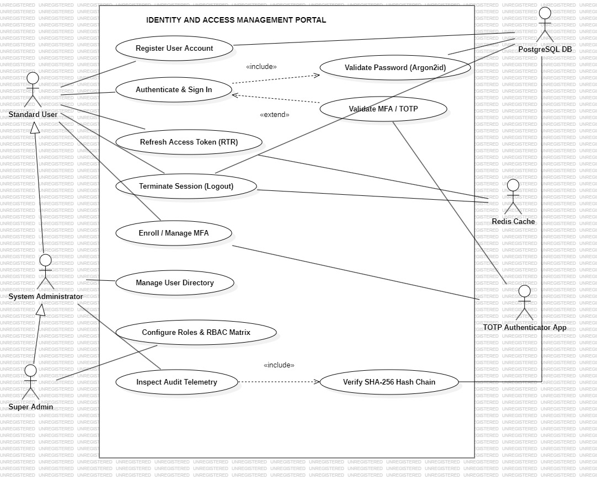

## UML USE CASE MODELING & SPECIFICATION

---

### **PROJECT DETAILS**
- **Project Title:** Aegis Identity and Access Management (IAM) Portal
- **Domain:** Cybersecurity, Enterprise Identity Governance & Cryptographic Access Control
---

## 1. AIM & OBJECTIVES
1. To identify and categorize the **Primary Actors**, **System Hierarchies (Generalizations)**, and **Secondary/External Supporting Systems** for an enterprise-grade Identity and Access Management (IAM) portal.
2. To design and construct a formal **UML 2.0 Use Case Diagram** establishing clear system boundaries, communication associations, `«include»` inclusions, and `«extend»` extensions.
3. To prepare formal, tabular **Use Case Narratives (Descriptions)** encompassing pre-conditions, post-conditions, normal execution courses, and security-critical alternative/exceptional flows.

---

## 2. HARDWARE & SOFTWARE REQUIREMENTS
- **Operating System:** Windows 11 / Linux (x86_64)
- **Modeling Software:** StarUML (v6.0+)
- **Runtime Environment:** Node.js (v20+ LTS)
- **Database / Cache:** PostgreSQL 16+, Redis 7+
- **Cryptographic Standard:** Argon2id, RFC 6238 TOTP, SHA-256 Chaining

---

## 3. SYSTEM OVERVIEW & ARCHITECTURE SCOPE
The **Aegis IAM Portal** is a mission-critical cybersecurity system engineered to govern digital identities, enforce dynamic Role-Based Access Control (RBAC), provide multi-factor authentication (MFA), and record tamper-evident audit trails.

### Core Architectural Pillars:
1. **Zero-Trust Identity Baseline:** Mandatory password hashing via memory-hard Argon2id and time-based one-time password (TOTP) MFA challenges.
2. **Stateful Token Security:** Refresh Token Rotation (RTR) with family-based tracking to detect token reuse attacks in real time.
3. **Cryptographic Tamper-Evidence:** Append-only audit logs linked via cryptographic SHA-256 hash chains (`H_n = SHA-256(H_{n-1} || Payload)`).

---

## 4. ACTOR IDENTIFICATION

### 4.1 Primary Human Actors
| Actor Name | Type | Description & System Responsibilities |
| :--- | :--- | :--- |
| **Standard User** | Human (Primary) | End-user who registers an account, authenticates, manages self-service MFA enrollment, refreshes session tokens, and logs out. |
| **System Administrator** | Human (Primary) | Privileged operator who inherits all Standard User capabilities, manages the user directory, assigns roles, and reviews system audit logs. |
| **Super Admin** | Human (Primary) | Root authority who inherits all Administrator capabilities and holds exclusive authority to configure custom roles and the global RBAC permission matrix. |

### 4.2 Secondary / External Supporting Actors
| System / Actor | Type | Interaction & Functional Role |
| :--- | :--- | :--- |
| **PostgreSQL DB** | External System (Secondary) | Authoritative persistent database storing Argon2id password hashes, AES-256-GCM encrypted MFA secrets, role definitions, Refresh Token Rotation (RTR) token lineage and SHA-256 hashes, and append-only cryptographic audit logs. |
| **Redis Cache** | External System (Secondary) | In-memory datastore managing immediate access-token revocation blacklists (`SETEX bl:<jti> <TTL> 1`) on logout and distributed sliding-window rate limiting. |
| **TOTP Authenticator App** | External System (Secondary) | Client device application (e.g., Google Authenticator) that generates and verifies 6-digit RFC 6238 time-based tokens. |

---

## 5. USE CASE RELATIONSHIP

| Source Element | Target Element | Relationship Type | Stereotype | Engineering Justification |
| :--- | :--- | :--- | :--- | :--- |
| `Super Admin` | `System Administrator` | Generalization | — | Super Admin inherits all System Administrator privileges. |
| `System Administrator` | `Standard User` | Generalization | — | System Administrator inherits all Standard User capabilities. |
| `Standard User` | `Authenticate & Sign In` | Association | — | Direct user initiation of login flow. |
| `Authenticate & Sign In` | `Validate Password (Argon2id)` | Dependency | **`«include»`** | Password validation is mandatory for every login attempt. |
| `Validate MFA / TOTP` | `Authenticate & Sign In` | Dependency | **`«extend»`** | MFA challenge is conditionally triggered only when 2FA is active. |
| `Inspect Audit Telemetry` | `Verify SHA-256 Hash Chain` | Dependency | **`«include»`** | Cryptographic hash verification is mandatory during audit inspections. |
| `Validate Password (Argon2id)` | `PostgreSQL DB` | Association | — | Reads stored Argon2id password hash for constant-time comparison. |
| `Refresh Access Token (RTR)` | `PostgreSQL DB` | Association | — | Authoritative database validating token hash, rotating token pair, and revoking entire token family on reuse detection. |
| `Terminate Session (Logout)` | `Redis Cache` | Association | — | Immediately blacklists access token unique identifier (`jti`) via `SETEX bl:<jti> <TTL> 1` until expiration. |
| `Terminate Session (Logout)` | `PostgreSQL DB` | Association | — | Authoritatively revokes active refresh token (`UPDATE refresh_tokens SET revoked = true`) to prevent token lineage continuation. |
| `Validate MFA / TOTP` | `TOTP Authenticator App` | Association | — | Verifies 6-digit RFC 6238 time-synchronized code. |

---

## 6. UML USE CASE DIAGRAM

The formal UML project model is maintained at:  
📁 [**`uml/Aegis_IAM_UseCase_Model.mdj`**](./uml/Aegis_IAM_UseCase_Model.mdj)

---

## 7. DETAILED USE CASE SPECIFICATIONS

---

### **USE CASE UC-01: Register User Account**
| Attribute | Specification Details |
| :--- | :--- |
| **Use Case ID** | **UC-01** |
| **Use Case Name** | Register User Account |
| **Primary Actor** | Standard User |
| **Secondary Actor** | PostgreSQL Database |
| **Use Case Type** | Base / Concrete Use Case |
| **Description** | Enables a prospective user to create an account by submitting unique identity credentials, which are sanitized and hashed using Argon2id. |
| **Pre-Conditions** | 1. User has network access to the IAM registration endpoint. 2. Email address is not previously registered in the system. |
| **Post-Conditions** | 1. User record is persisted in PostgreSQL with status `ACTIVE`. 2. Password is cryptographically hashed at rest using Argon2id (`timeCost: 3, memoryCost: 65536, parallelism: 4`). 3. Registration event is cryptographically recorded in the SHA-256 audit log. |
| **Typical Course of Events (Normal Flow)** | **1. Actor Action:** User submits username, email, and plaintext password via the portal. **2. System Response:** System validates input formatting and password entropy constraints. **3. System Response:** System computes Argon2id memory-hard password hash. **4. System Response:** System writes new record to PostgreSQL DB and creates genesis audit trail entry. **5. System Response:** System returns HTTP 201 Created and directs user to login. |
| **Alternative / Exceptional Flows** | **Flow 1a (Email Conflict):** If the email already exists, system halts creation and returns `HTTP 409 Conflict: Identity already registered`. **Flow 1b (Weak Password):** If password does not meet 12+ character and complexity requirements, system returns `HTTP 422 Unprocessable Entity`. |

---

### **USE CASE UC-02: Authenticate & Sign In**
| Attribute | Specification Details |
| :--- | :--- |
| **Use Case ID** | **UC-02** |
| **Use Case Name** | Authenticate & Sign In |
| **Primary Actor** | Standard User (and generalized actors) |
| **Secondary Actor** | PostgreSQL DB |
| **Use Case Type** | Core Concrete Use Case (includes UC-02a, extended by UC-02b) |
| **Description** | Validates identity credentials, initiates a cryptographically signed JWT token pair (Short-lived Access Token + RTR Refresh Token), and creates an active session. |
| **Pre-Conditions** | User possesses an active, unblocked account in PostgreSQL. |
| **Post-Conditions** | 1. User receives signed RS256/HS256 Access Token (15-min TTL) and Refresh Token (7-day TTL). 2. Refresh token hash and family lineage are persisted in PostgreSQL DB. 3. Successful login event is chained into the audit log. |
| **Typical Course of Events (Normal Flow)** | **1. Actor Action:** User submits username/email and password. **2. System Response:** System executes **`«include»` UC-02a: Validate Password (Argon2id)**. **3. System Response:** System checks if MFA is active. If active, triggers **`«extend»` UC-02b: Validate MFA / TOTP Challenge**. **4. System Response:** System generates JWT Access Token and Refresh Token with new family ID. **5. System Response:** System stores hashed refresh token and family record in PostgreSQL DB. **6. System Response:** System returns authenticated session payload to user. |
| **Alternative / Exceptional Flows** | **Flow 2a (Invalid Credentials):** If password verification fails, system increments failed attempt counter, records `AUTH_FAILURE` audit log, and returns `HTTP 401 Unauthorized`. **Flow 2b (Account Locked):** If failed attempts exceed threshold (5 attempts), system locks account for 15 minutes and returns `HTTP 423 Locked`. |

---

### **USE CASE UC-02a: Validate Password (Argon2id)**
| Attribute | Specification Details |
| :--- | :--- |
| **Use Case ID** | **UC-02a** |
| **Use Case Name** | Validate Password (Argon2id) |
| **Primary Actor** | Invoked internally by `Authenticate & Sign In` |
| **Secondary Actor** | PostgreSQL DB |
| **Use Case Type** | **`«include»` Sub-Routine Use Case** |
| **Description** | Performs constant-time, memory-hard Argon2id cryptographic verification between user-submitted plaintext and the database hash. |
| **Pre-Conditions** | Plaintext password received; user record retrieved from database. |
| **Post-Conditions** | Boolean validation flag returned to calling use case without leaking timing side-channel data. |
| **Typical Course of Events** | **1.** System reads stored Argon2id hash from PostgreSQL. **2.** System executes `argon2.verify(storedHash, plaintextPassword)` utilizing constant-time comparison. **3.** Verification succeeds; control returns to base use case. |
| **Alternative Flow** | **Flow 2a.1:** Hash comparison mismatch; system returns failure status to calling use case. |

---

### **USE CASE UC-02b: Validate MFA / TOTP Challenge**
| Attribute | Specification Details |
| :--- | :--- |
| **Use Case ID** | **UC-02b** |
| **Use Case Name** | Validate MFA / TOTP Challenge |
| **Primary Actor** | Standard User |
| **Secondary Actor** | TOTP Authenticator App |
| **Use Case Type** | **`«extend»` Optional Extension Use Case** |
| **Extension Point** | `OnMfaEnabledCondition` in `Authenticate & Sign In` |
| **Description** | Conditionally challenges the user for an RFC 6238 6-digit one-time passcode generated by their registered authenticator app. |
| **Pre-Conditions** | Primary password validation succeeded; user record has `mfa_enabled = true`. |
| **Post-Conditions** | Full authentication tokens issued only upon successful TOTP verification. |
| **Typical Course of Events** | **1.** System presents MFA challenge screen. **2.** Actor provides current 6-digit TOTP code. **3.** System decrypts stored AES-256-GCM secret and validates code against current time window (±1 step tolerance). **4.** Code validated; authentication completes. |
| **Alternative Flow** | **Flow 2b.1 (Invalid/Expired OTP):** Code fails verification; user is prompted to retry. Session is aborted after 3 failed attempts. |

---

### **USE CASE UC-03: Refresh Access Token with RTR**
| Attribute | Specification Details |
| :--- | :--- |
| **Use Case ID** | **UC-03** |
| **Use Case Name** | Refresh Access Token (Refresh Token Rotation - RTR) |
| **Primary Actor** | Standard User (Client Application) |
| **Secondary Actor** | PostgreSQL DB |
| **Use Case Type** | Core Use Case |
| **Description** | Exchanges a valid Refresh Token for a brand-new token pair while immediately invalidating the old token in PostgreSQL and checking for token replay attacks. |
| **Pre-Conditions** | Client presents a valid, unexpired Refresh Token. |
| **Post-Conditions** | 1. Old refresh token is marked revoked in PostgreSQL. 2. New refresh token issued within the same Family ID and stored in PostgreSQL. 3. New access token issued. |
| **Typical Course of Events** | **1.** Client sends HTTP POST with current refresh token. **2.** System hashes token and retrieves token family state from PostgreSQL DB. **3.** System verifies token has not been previously revoked or expired. **4.** System revokes old token and generates new Access Token and rotated Refresh Token. **5.** System persists new token hash in PostgreSQL under the same family ID and returns new tokens. |
| **Alternative / Exceptional Flows** | **Flow 3a (Reuse Breach Detection):** If a presented refresh token was *already revoked*, system flags a **token theft breach**, immediately revokes the **entire token family** in PostgreSQL (`UPDATE refresh_tokens SET revoked = true WHERE family_id = $1`), and logs a critical `SECURITY_BREACH_RTR_REPLAY` audit alert. |

---

### **USE CASE UC-04: Terminate Session (Logout)**
| Attribute | Specification Details |
| :--- | :--- |
| **Use Case ID** | **UC-04** |
| **Use Case Name** | Terminate Session (Logout & Dual-Store Token Revocation) |
| **Primary Actor** | Standard User |
| **Secondary Actor** | Redis Cache, PostgreSQL DB |
| **Use Case Type** | Core Security Use Case |
| **Description** | Coordinates session invalidation across two independent datastores via a compensated dual-store workflow: blacklists the access token's unique identifier (`jti`) into Redis with exact remaining TTL, authoritatively marks the refresh token revoked in PostgreSQL, and enforces conditional completion and failure compensation. |
| **Pre-Conditions** | User holds an active, authenticated session presenting a valid access token (`jti`), a refresh token, or both. |
| **Post-Conditions** | 1. If access token is provided: token `jti` is confirmed stored in Redis blacklist (`bl:<jti>`) with remaining TTL. 2. If refresh token is provided: token hash is confirmed revoked (`revoked = true`) in PostgreSQL DB. 3. Client cookies are cleared, and logout is reported as complete (`HTTP 200 OK`) **only after all applicable presented token revocations are confirmed**. |
| **Typical Course of Events (Normal Flow)** | **1. Actor Action:** User submits logout request presenting access token (`jti`), refresh token, or both. **2. System Response:** System inspects the presented token credentials and executes the relevant datastore operations: &nbsp;&nbsp;&nbsp;&nbsp;a. **Access Token Path:** Extracts `jti` and remaining lifetime (`TTL = exp - now`) and executes `SETEX bl:<jti> <TTL> 1` in Redis Cache. &nbsp;&nbsp;&nbsp;&nbsp;b. **Refresh Token Path:** Hashes token and executes `UPDATE refresh_tokens SET revoked = true WHERE token_hash = $1` in PostgreSQL DB. **3. System Response:** System confirms write acknowledgment for each presented token path. **4. System Response:** System purges client session cookies and returns `HTTP 200 OK: Session Terminated`. |
| **Alternative / Exceptional Flows (Failure Handling & Compensation)** | **Flow 4a (Dual-Token: Redis Failure, PostgreSQL Success):** When both tokens are presented, if Redis `SETEX` fails while PostgreSQL refresh token revocation succeeds, the system triggers up to 3 immediate idempotent retries with exponential backoff. If Redis remains unavailable, the system invalidates the entire refresh token family in PostgreSQL (preventing subsequent token issuance), clears client cookies, records a `WARN_REDIS_BLACKLIST_UNAVAILABLE` audit telemetry event, and dispatches the JTI to a durable background worker for asynchronous retry.  **Flow 4b (Dual-Token: PostgreSQL Failure, Redis Success):** When both tokens are presented, if Redis `SETEX` succeeds but the PostgreSQL update fails, the access token is neutralized in memory, but the refresh token remains potentially active. The system executes idempotent retry queries against PostgreSQL. If persistent failure occurs, the system flags the session in Redis with an emergency revocation lock and returns an error response (`HTTP 500 / Partial Failure`) without reporting logout as complete until both stores achieve synchronized invalidation.  **Flow 4c (Single-Token Session Failure):** If only an access token is presented and Redis fails, or if only a refresh token is presented and PostgreSQL fails, the system executes idempotent retries and returns `HTTP 500` if the target datastore remains unresponsive.  **Flow 4d (Missing Token Context):** If a logout request is received without an access token JTI or a refresh token, the system aborts execution and returns `HTTP 400 Bad Request: No active session credentials supplied`.  **Completion Gate:** Logout is acknowledged as complete (`HTTP 200 OK`) conditionally based on the submitted credentials: requiring dual confirmation (both Redis and PostgreSQL) when both tokens are presented, or confirming the corresponding single datastore when only one token is supplied. |

---

### **USE CASE UC-05: Enroll / Manage MFA**
| Attribute | Specification Details |
| :--- | :--- |
| **Use Case ID** | **UC-05** |
| **Use Case Name** | Enroll / Manage MFA (TOTP Setup & Post-Promotion Elevation) |
| **Primary Actor** | Standard User / Promoted Administrator |
| **Secondary Actor** | TOTP Authenticator App, PostgreSQL DB, Redis Cache |
| **Use Case Type** | Core Security Use Case |
| **Description** | Generates an RFC 6238 compliant cryptographic secret, renders a QR code for authenticator app pairing, and stores the AES-256-GCM encrypted secret upon verification. Supports both standard self-service user enrollment and mandatory post-promotion elevation via scoped enrollment tokens (`mfa:enroll_only`). |
| **Pre-Conditions** | 1. User holds an active session token OR a valid, unexpired scoped MFA Enrollment Token (`scope: 'mfa:enroll_only'`). 2. Account status is `ACTIVE`. |
| **Post-Conditions** | 1. Encrypted secret stored in PostgreSQL; `mfa_enabled` set to `true`. 2. For enrollment token flows: token `jti` is atomically claimed in Redis (`SET NX`), user row is locked `FOR UPDATE`, and full elevated session tokens are issued upon confirmation. |
| **Typical Course of Events (Standard Flow)** | **1.** User requests MFA enrollment. **2.** System generates base32 secret and displays QR code. **3.** User scans QR code using Authenticator App and submits first 6-digit code. **4.** System verifies code; encrypts secret using AES-256-GCM and persists in PostgreSQL. **5.** System provides one-time backup recovery codes. |
| **Zero-Trust Post-Promotion Flow** | **Flow 5a (Mandatory Administrative Enrollment):** **1.** Promoted user authenticates at `/login` and receives scoped `mfa:enroll_only` token. **2.** System routes user to `/mfa-setup` and initiates enrollment via `authenticateMfaEnrollment` middleware. **3.** Promoted user scans QR code and submits 6-digit TOTP code to `/api/v1/mfa/verify`. **4.** System atomically claims token in Redis via `SET mfa:enrollment:<jti> claimToken EX <TTL> NX` to prevent replay. **5.** Under user row lock `FOR UPDATE`, system verifies user role still mandates MFA (rejecting if demoted in the interim). **6.** System commits `mfa_enabled = true`, issues fresh administrative Access & Refresh tokens, logs `MFA_ENABLED` audit event, and directs user to `/dashboard`. |

---

### **USE CASE UC-06: Manage User Directory & Role Promotion Lifecycle**
| Attribute | Specification Details |
| :--- | :--- |
| **Use Case ID** | **UC-06** |
| **Use Case Name** | Manage User Directory & Zero-Trust Role Promotion/Demotion |
| **Primary Actor** | System Administrator / Super Admin |
| **Secondary Actor** | PostgreSQL DB (Transaction Client), Redis Cache |
| **Use Case Type** | Administrative Core Use Case |
| **Description** | Allows administrators to search, inspect, activate/deactivate accounts, and govern the user role lifecycle with pessimistic row locking, atomic tier replacement, transaction-bound session revocation, and directional audit logging. |
| **Pre-Conditions** | Administrator possesses authenticated session with `user:read` / `role:update` permissions. |
| **Post-Conditions** | Target user account state/roles updated in PostgreSQL DB; all active sessions revoked on privilege transition. |
| **Typical Course of Events (Normal Role Assignment)** | **1. Actor Action:** Administrator selects user and submits new role assignment. **2. System Response:** System opens PostgreSQL transaction and acquires pessimistic lock: `SELECT id, email FROM users WHERE id = $1 FOR UPDATE`. **3. System Response:** System atomically deletes conflicting system-tier roles (`super_admin`, `admin`, `user`) and inserts target role. **4. System Response:** System determines privilege transition (Promotion or Demotion). **5. System Response:** System executes `tokenService.revokeAllUserTokens(userId, client)` inside the same transaction boundary. **6. System Response:** If demoting an elevated administrator to standard `user`, system purges pending unconfirmed MFA secrets. **7. System Response:** System writes directional audit entries: `ROLE_ASSIGNED` and either `ROLE_PROMOTION_SESSION_REVOKED` (for promotion) or `TOKEN_REVOKED` (for demotion). **8. System Response:** System commits transaction (`COMMIT`) and returns `{ assigned: true, sessionsRevoked: true, roleName }`. |
| **Alternative / Exceptional Flows** | **Flow 6a (Idempotent No-Op):** If user already holds the target role and no conflicting system roles were removed, system commits immediately and returns `{ assigned: false, sessionsRevoked: false }` without invalidating sessions or generating audit records. **Flow 6b (Revocation Failure & Transaction Rollback):** If session token revocation fails (e.g. database connectivity glitch during update), the system executes `ROLLBACK`, restoring previous user roles with zero state change and returning `HTTP 500 Internal Error`. **Flow 6c (Account Activation / Deactivation):** Admin toggles user status via `/api/v1/users/:id/status` or `/activate`. On deactivation, active sessions are revoked immediately. |

---

### **USE CASE UC-07: Configure Roles & RBAC Matrix**
| Attribute | Specification Details |
| :--- | :--- |
| **Use Case ID** | **UC-07** |
| **Use Case Name** | Configure Roles & RBAC Matrix |
| **Primary Actor** | Super Admin |
| **Secondary Actor** | PostgreSQL DB |
| **Use Case Type** | Administrative Use Case (Root Scope) |
| **Description** | Grants Super Administrators exclusive capability to define custom enterprise roles, assign granular permissions, and modify system access policies. |
| **Pre-Conditions** | Authenticated actor holds `SUPER_ADMIN` role credentials. |
| **Post-Conditions** | Role-permission mappings updated in PostgreSQL; active role caches invalidated. |
| **Typical Course of Events** | **1.** Super Admin accesses RBAC Matrix configuration. **2.** System loads current permissions grid. **3.** Super Admin defines a new role or adjusts permission flags. **4.** System commits updated RBAC schema to PostgreSQL and creates an immutable audit record. |

---

### **USE CASE UC-08: Inspect Audit Telemetry**
| Attribute | Specification Details |
| :--- | :--- |
| **Use Case ID** | **UC-08** |
| **Use Case Name** | Inspect Audit Telemetry |
| **Primary Actor** | System Administrator / Security Auditor |
| **Secondary Actor** | PostgreSQL DB |
| **Use Case Type** | Core Compliance Use Case (includes UC-08a) |
| **Description** | Retrieves system security telemetry, actor actions, and timestamps while automatically validating the cryptographic integrity of the log sequence. |
| **Pre-Conditions** | Actor holds `audit:read` permission. |
| **Post-Conditions** | Audit telemetry displayed with verified tamper-evidence status badge. |
| **Typical Course of Events** | **1.** Administrator opens Audit Telemetry console. **2.** System executes **`«include»` UC-08a: Verify SHA-256 Hash Chain** across the log dataset. **3.** System returns verified log records with cryptographic status to the console. |

---

### **USE CASE UC-08a: Verify SHA-256 Hash Chain**
| Attribute | Specification Details |
| :--- | :--- |
| **Use Case ID** | **UC-08a** |
| **Use Case Name** | Verify SHA-256 Hash Chain |
| **Primary Actor** | Invoked internally by `Inspect Audit Telemetry` |
| **Secondary Actor** | PostgreSQL DB |
| **Use Case Type** | **`«include»` Sub-Routine Use Case** |
| **Description** | Traverses all audit log records from genesis (`H_0`), recomputing `H_n = SHA-256(H_{n-1} || Timestamp || Actor || Action)` to mathematically verify that zero database rows have been modified, deleted, or injected. |
| **Pre-Conditions** | Audit records fetched from PostgreSQL. |
| **Post-Conditions** | Integrity status (VERIFIED or TAMPER_DETECTED) returned with broken block index if compromised. |
| **Typical Course of Events** | **1.** System reads ordered audit records from genesis block. **2.** System iterates through entries, recalculating expected SHA-256 hash for each row. **3.** All computed hashes match stored values; returns `VALIDATED`. |
| **Alternative Flow** | **Flow 8a.1 (Tamper Detected):** If any hash mismatch is found, system raises a critical security alarm: `TAMPER_DETECTED at Block #ID`. |
